# String
- String is immutable (not change)

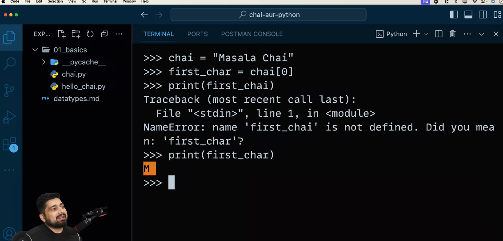

- Slice in string
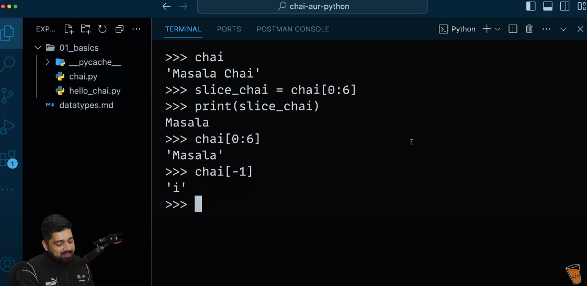
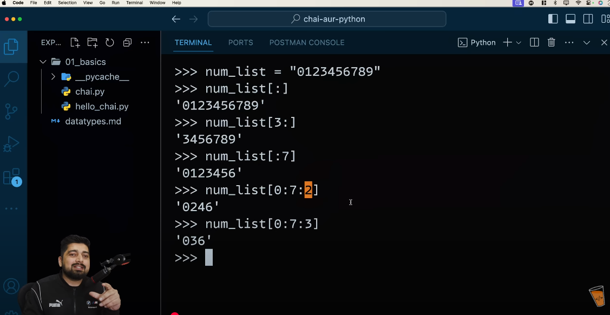

- convert string to 'uppercase' and 'lowercase'
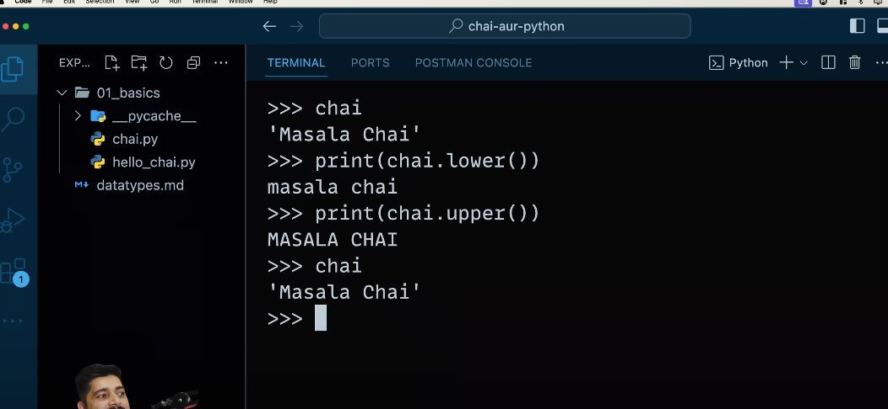

- Use 'Strip' for removing unwanted spaces.
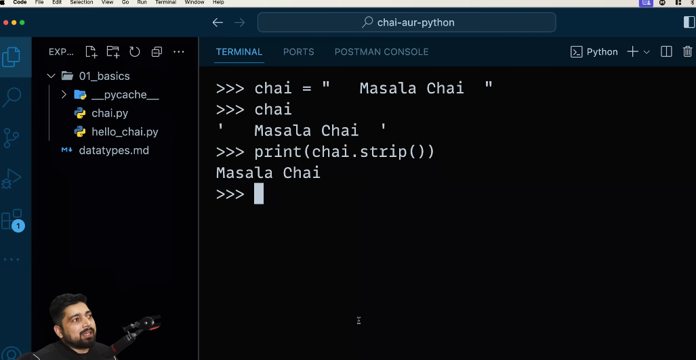

- 'Replace' word in string
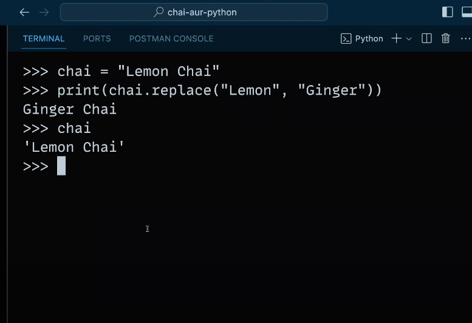

- 'split()' method using for splitting (String to tuple).
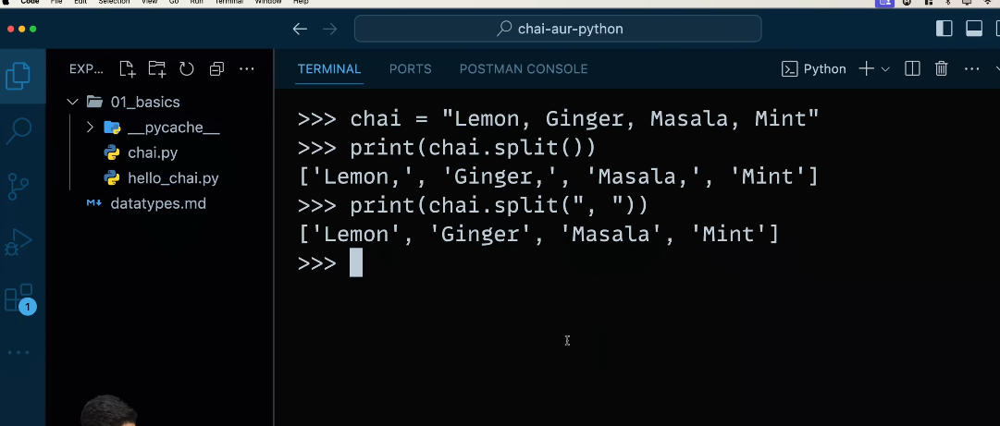

- 'find' function using for finding any word in string and also 'count' for counting a specific word on a string
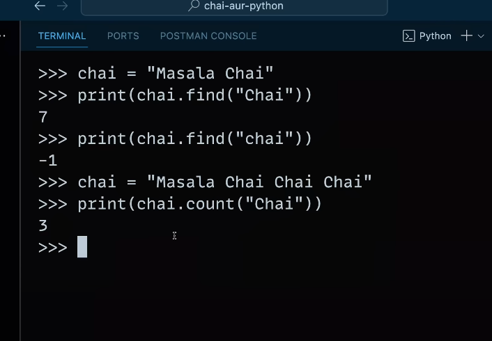

- How to add values in string
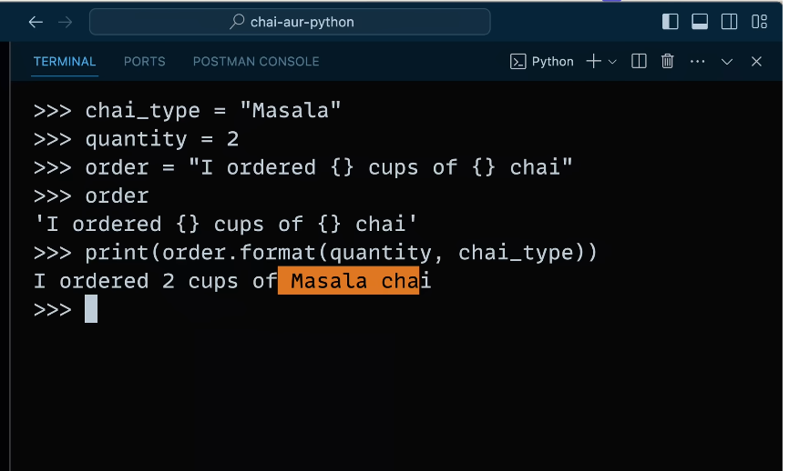

-Tuple to string
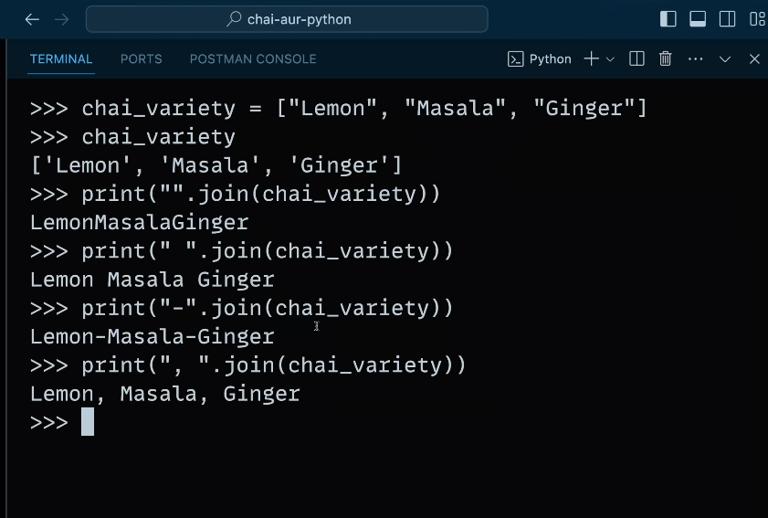

-length of string
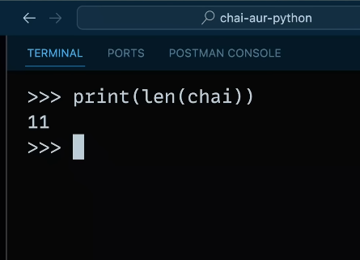
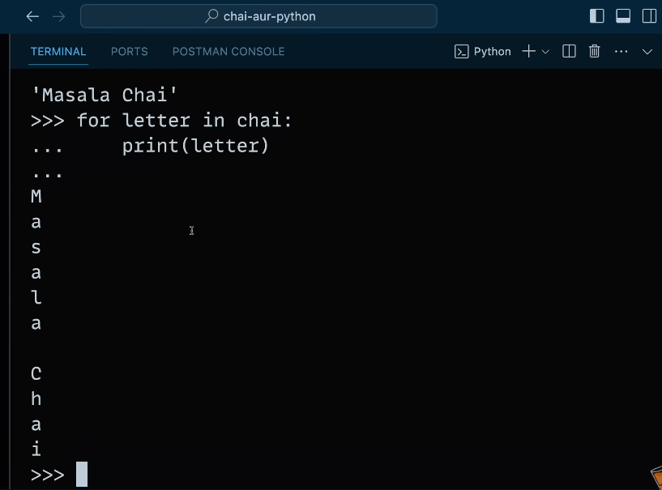

============================
- We are using 'r' intially for treating string as raw. Even we using any '/n'
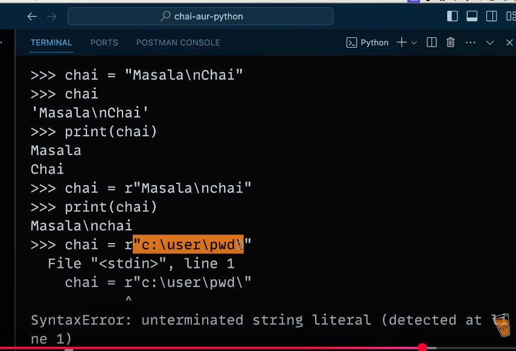
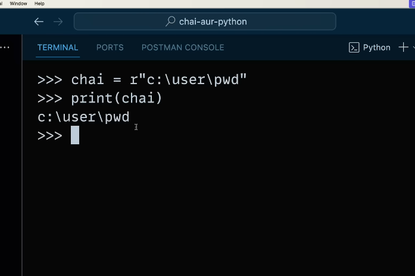
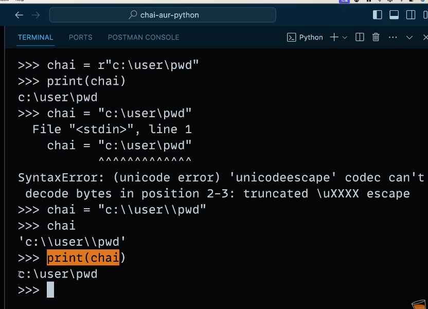

- For get to know that, that specific character is present in the given string or not.
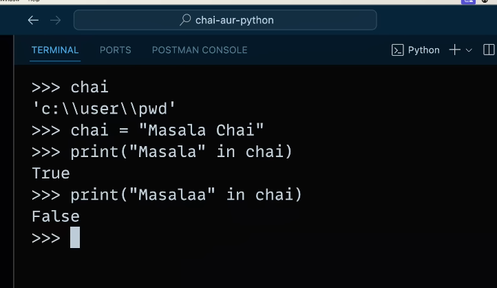