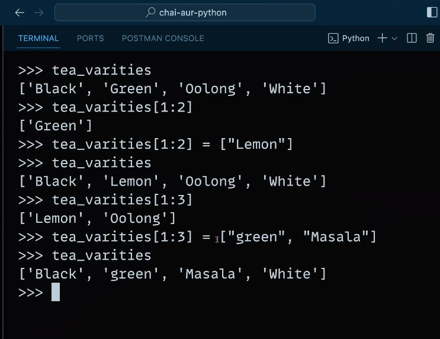

# List (List is 'mutable', it can change.)

- For changing the reference in memory,we are using copy() inbuilt method if we give the same name to another variable.

- Range in python:

- List comprehension:
