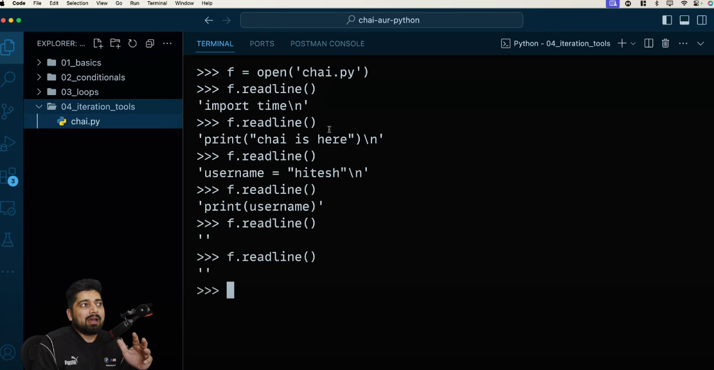
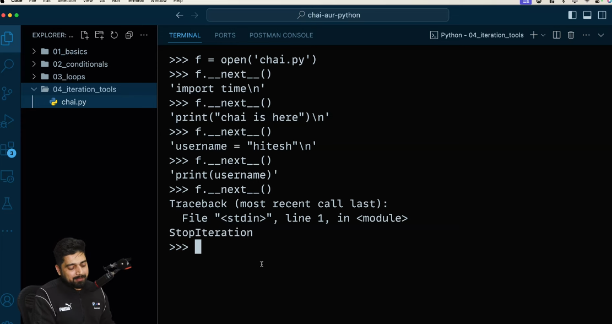
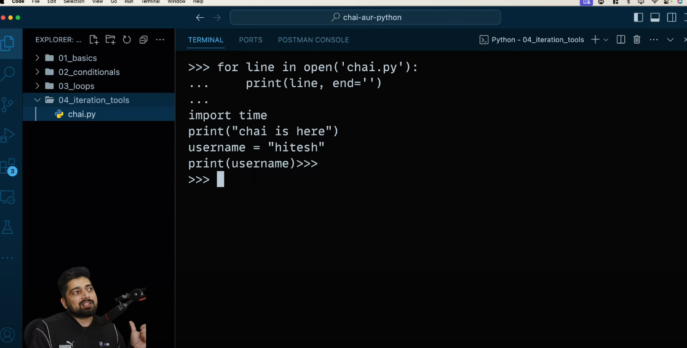
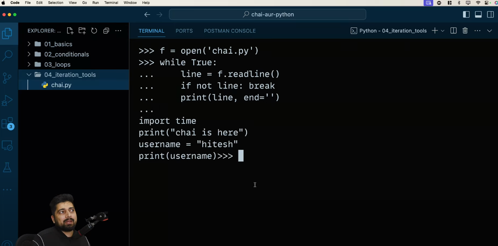
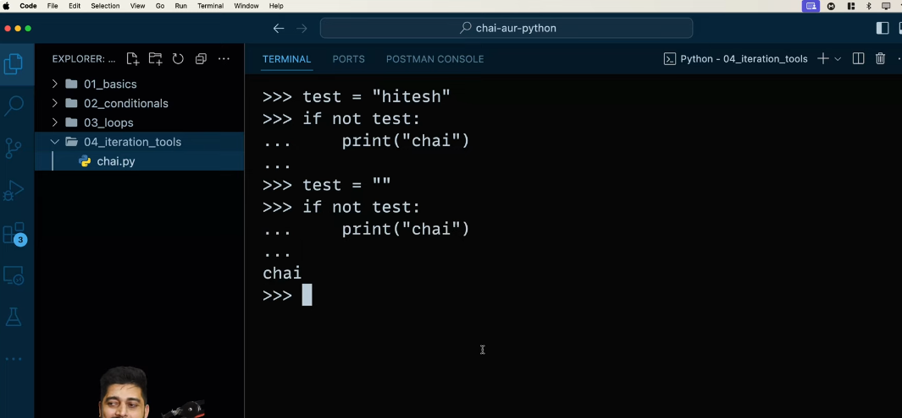
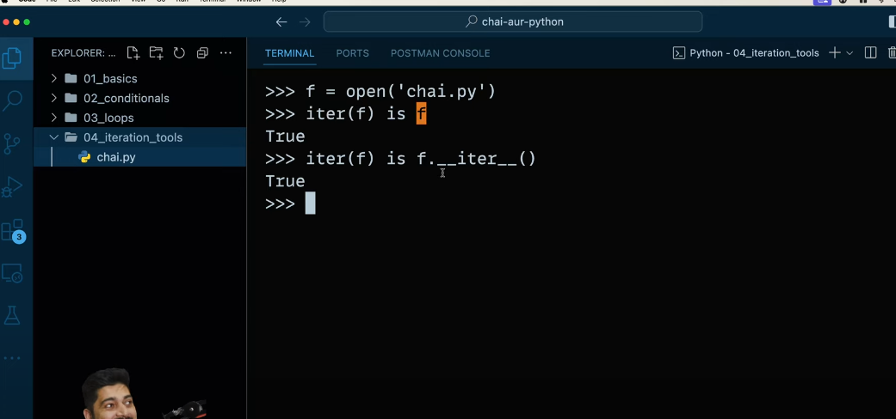
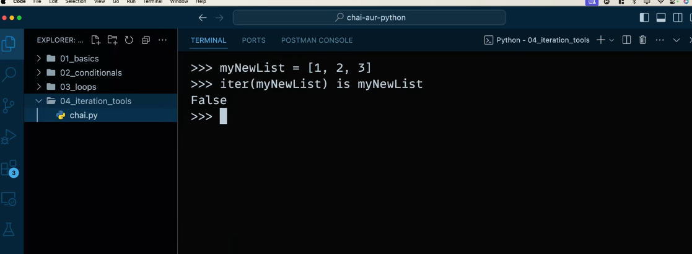
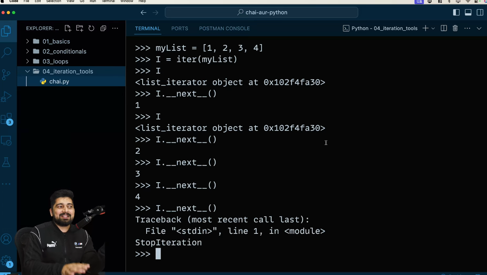
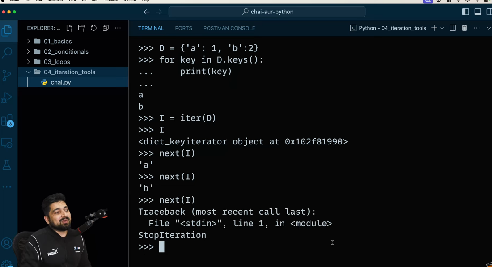
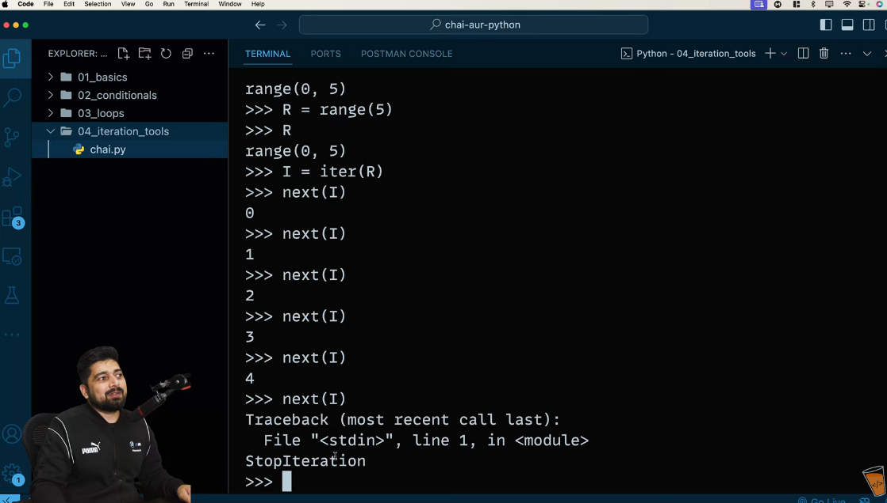

File is stores like Array, so we can get a value from a file as same as we can get a data from an array.

In File, we have inbuilt 'iter' tool but for any other iterable object we have to use 'iter' function.

