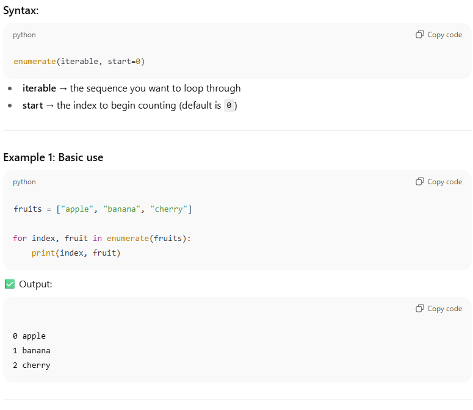
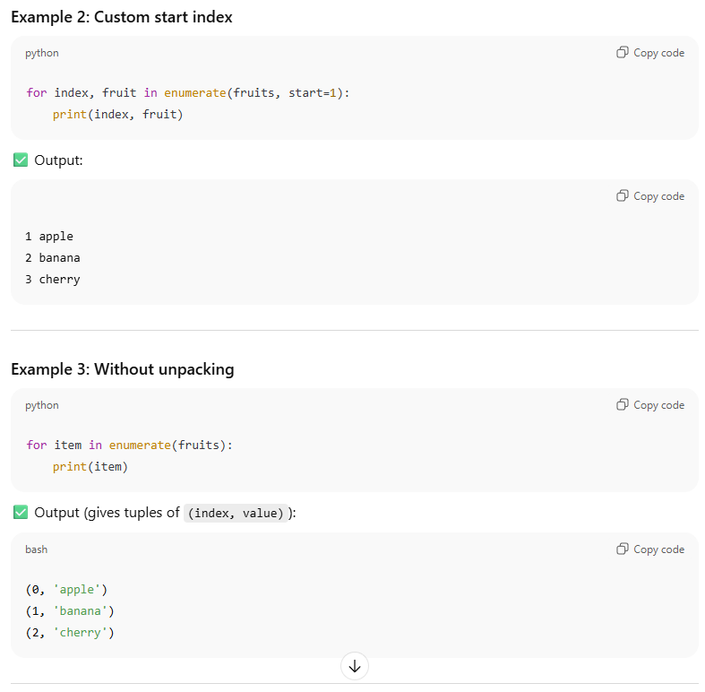

# what is enumerate in python
enumerate in Python is a built-in function that lets you loop through an iterable (like a list, tuple, or string) while keeping track of the index of each item.

👉 In short:
enumerate is useful when you need both the index and the value while looping, instead of using something like range(len(fruits)).