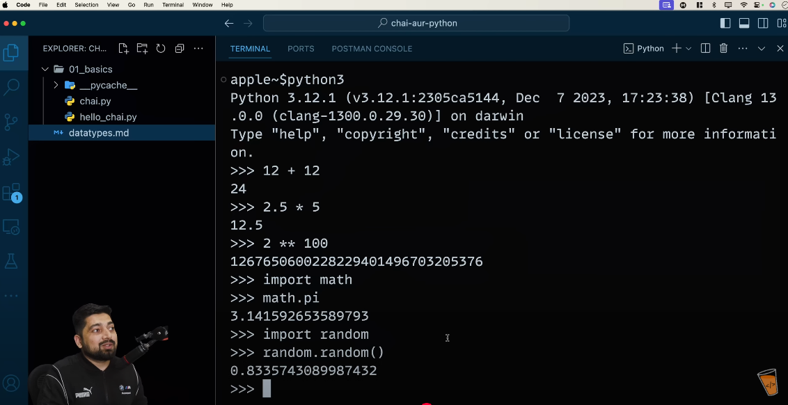
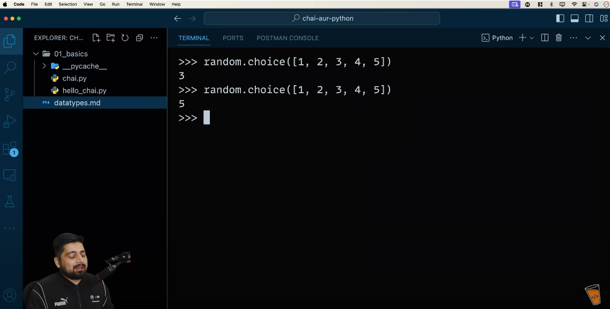
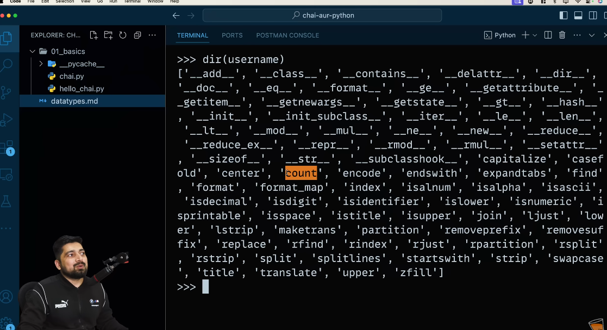
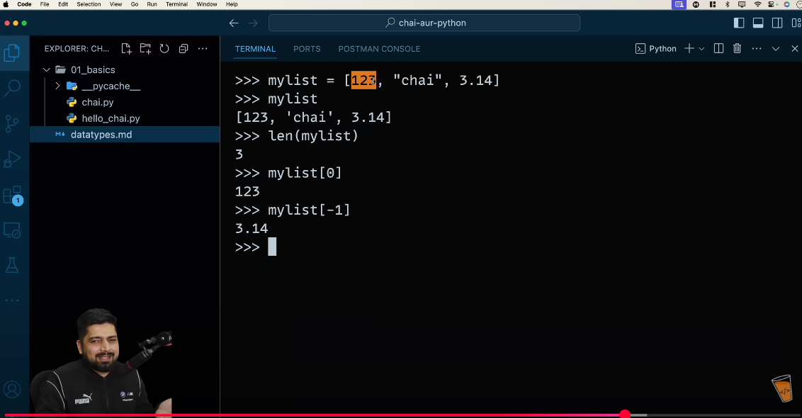
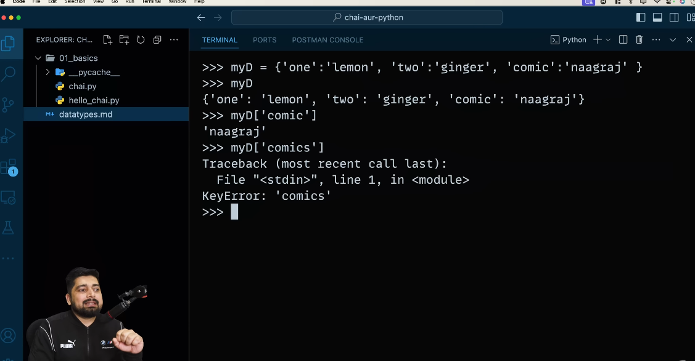
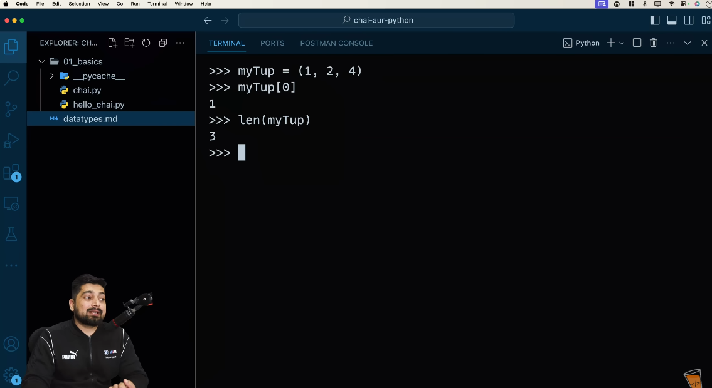

- [] : Brackets
- () : Parenthesis
- {} : curly braces / braces

Python can calculated meta calculations very easily.

# Object Types / Data Types

- Number : 1234, 3.1415, 3+4j, 0b111, Decimal(), Fraction()
- String : 'spam', "Bob's", b'a\x01c', u'sp\xc4m'
- List : [1, [2, 'three'], 4.5], list(range(10))
- Tuple : (1, 'spam', 4, 'U'), tuple('spam'), namedtuple
- Dictionary (key: value pair) : {'food': 'spam', 'taste': 'yum'}, dict(hours=10)

- Set : set('abc'), {'a', 'b', 'c'}

- File : open('eggs.txt'), open(r'C:\ham.bin', 'wb')

- Boolean : True, False
- None : None
- Funtions, modules, classes

- Advance: Decorators, Generators, Iterators, MetaProgramming

# String are also treated as array, like arrays we can get value by using indexes. Same work we can do by using string.

Can get help by using dir() function:

# List
- In Python, 'list' is same as 'Array'.

# Dictionary

# Tuples

