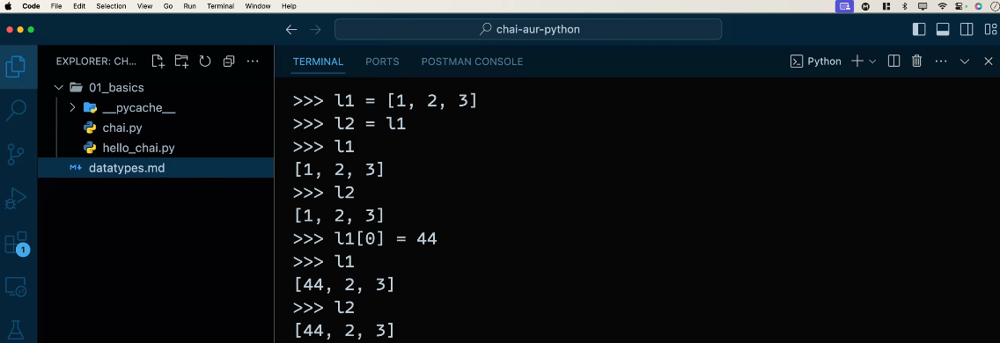
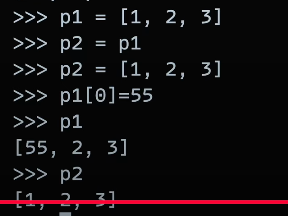
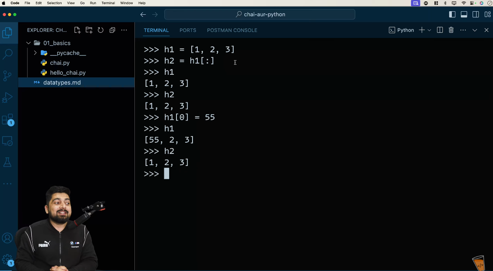
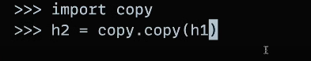
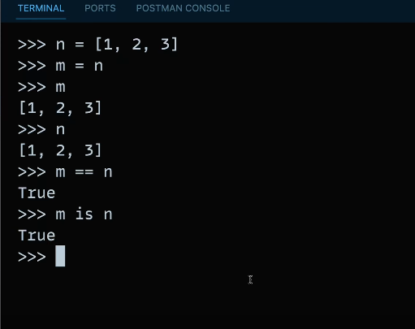
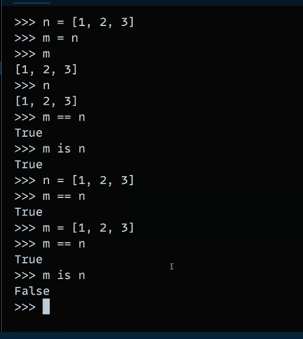

# Internal behaviour of python

Python is an interpreted language and it uses the interpreter to run your code. The Python interpreter reads each line of source code and executes them individually. This means that every statement in a program will be executed by the python interpreter sequentially from top to bottom, left to right.

In python, variable has no data type, but inside a variable can be stored any datatype which can be anything.

- List is mutable: 

- If you refers to a variable by using slicing then that variable makes a copy of assigning value in it, and the original variable remains unchanged:

OR

- You can also use deep copy, but this is not recommended to be used because it takes more time than normal copy operation, but 'deep copy' can contain list of list or any other nested data structure, Syntax at below:

- Here, we can check also that the variable is refere to the same memory location, Syntax is: (m is n)

- Here, we assign same value but they will create another memory location that's why they will give us False:

And in python, they check dynamically data type and it will store on memory not the variable which will be assign.