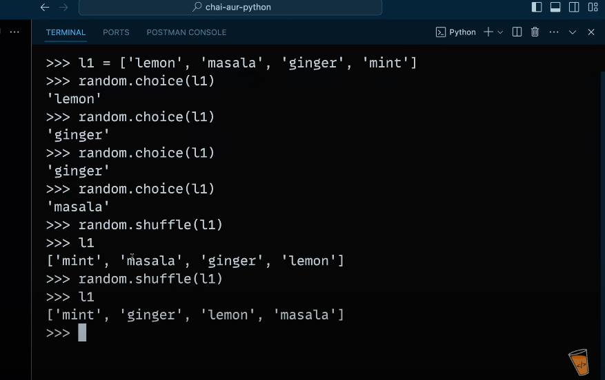

# Numbers in python

We should use same data type while working with numbers. As, same data types of int, float etc. When we do any addition, subsctraction, multiplication etc.

- When we print our data by using commas(,) we got result in tuple ():

- Both syntax are same, but second one is good approach:

-Examples: 

- Python can also do 'Imaginary numbers' or (iota numbers) like (2 + 3j), but we don't use them at large scale:

- How to do octa(8), hexa(x) and binary(b) number in python:

Or another method to get these values by using 'hitesh sir' personally:

- In python, we have also 'bitwise' operator, but below is an example of
left shift(<<), but we have also exist right shift (>>) and bitwise AND (&):

# Random function in Python:
- Need to import random module

- We can also give our own values and random function will get values from them, and we have shuffle which work only to shuffle our values like below example:

# In python, we have do addtion or substraction of decimal numbers, they give us a wrong result. So for solving this problem we need to use 'from decimal import Decimal', and for 'fraction' import Fraction:

# Set :
- It is same as 'set' which we are having in our mathematics, it is also used by curly braces{} like dictionary but dictionary have {key: value} pair and here in set we don't have this pair.
- The type of 'dictionary' is '{}' and type of set is 'set()'.
-In python, by using 'Set' we can also get 'intersection'(&) and 'union'(|).
- By using intersection, we are getting common elements of two sets and In 'Union', we are getting all unique values which are existing in both the tables, also we can substraction(-) set and also do superset(^) like below example:

- A superset is a set that contains all the elements of another set, possibly along with additional elements. It is a relationship between two sets, where one set includes every element of another set.

# Boolean type:

